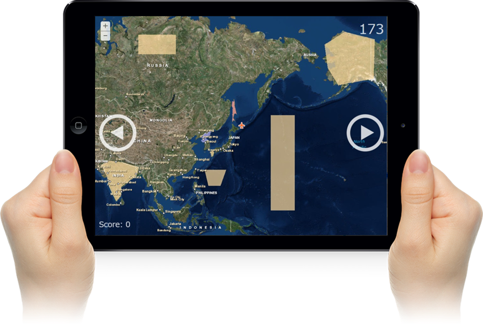

# flightsim-game-controller-js

Web Socket を利用した双方向通信によりマルチユーザー プレイを実現したフライト シミュレーター ゲームの操作アプリです。
全機の位置とスコア ランキングを管理する[モニター用のネイティブ アプリ](https://github.com/esrijapan/flightsim-game-monitor-dotnet)と連携します。

※公開ソースコードで操作できるのは機体の移動のみです。マルチユーザー プレイと加点減点処理を行うには独自に Web Socket サーバー（[ArcGIS GeoEvent Extension for Server](http://www.esrij.com/products/arcgis-for-server/details/arcgis-geoevent-extension-for-server/)）を設置する必要があります。

[http://esrijapan.github.io/flightsim-game-controller-js/](http://esrijapan.github.io/flightsim-game-controller-js/)

## 使用している製品・プロジェクト

* [ArcGIS API for JavaScript](https://developers.arcgis.com/javascript/)
* [ArcGIS for Developers](https://developers.arcgis.com/en/)
* [ArcGIS GeoEvent Extension for Server](https://server.arcgis.com/ja/geoevent-extension/)
* [Vague.js](https://github.com/GianlucaGuarini/vague.js/)
* [jQuery](https://github.com/jquery)

**ArcGIS の開発キットを使用して開発を行う場合は ArcGIS Online 開発者アカウント（[ArcGIS for Developers](https://developers.arcgis.com/en/)）が必要です。開発者アカウント作成ガイドは[こちら](http://www.esrij.com/cgi-bin/wp/wp-content/uploads/documents/signup-esri-developers.pdf)**

## 動作環境

* Chrome (Android)
* Safari (iOS)

## リソース

* [GeoNet 開発者コミュニティ サイト](https://geonet.esri.com/groups/devcom-jp)
* [ArcGIS API for JavaScript（ESRIジャパン）](http://www.esrij.com/products/arcgis-api-for-javascript/)
* [ArcGIS API for JavaScript リファレンス](https://developers.arcgis.com/javascript/jsapi/)
* [Vague.js](https://gianlucaguarini.github.io/Vague.js/)
* [jQuery](https://jquery.com/)

## ライセンス
Copyright 2015 Esri Japan Corporation.

Apache License Version 2.0（「本ライセンス」）に基づいてライセンスされます。あなたがこのファイルを使用するためには、本ライセンスに従わなければなりません。本ライセンスのコピーは下記の場所から入手できます。

> http://www.apache.org/licenses/LICENSE-2.0

適用される法律または書面での同意によって命じられない限り、本ライセンスに基づいて頒布されるソフトウェアは、明示黙示を問わず、いかなる保証も条件もなしに「現状のまま」頒布されます。本ライセンスでの権利と制限を規定した文言については、本ライセンスを参照してください。

ライセンスのコピーは本リポジトリの[ライセンス ファイル](./LICENSE)で利用可能です。

